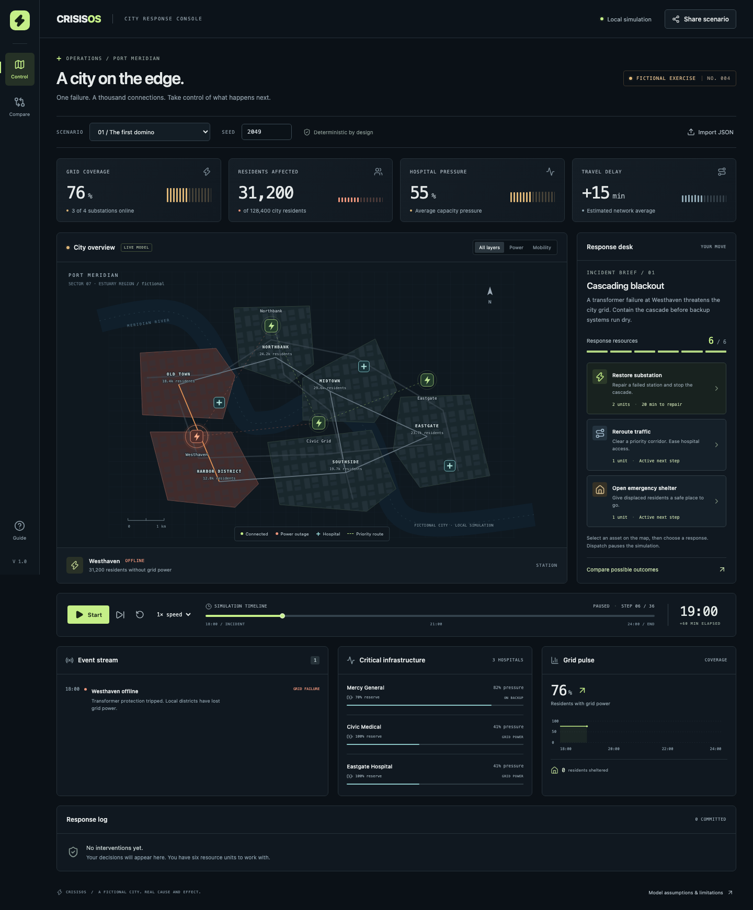
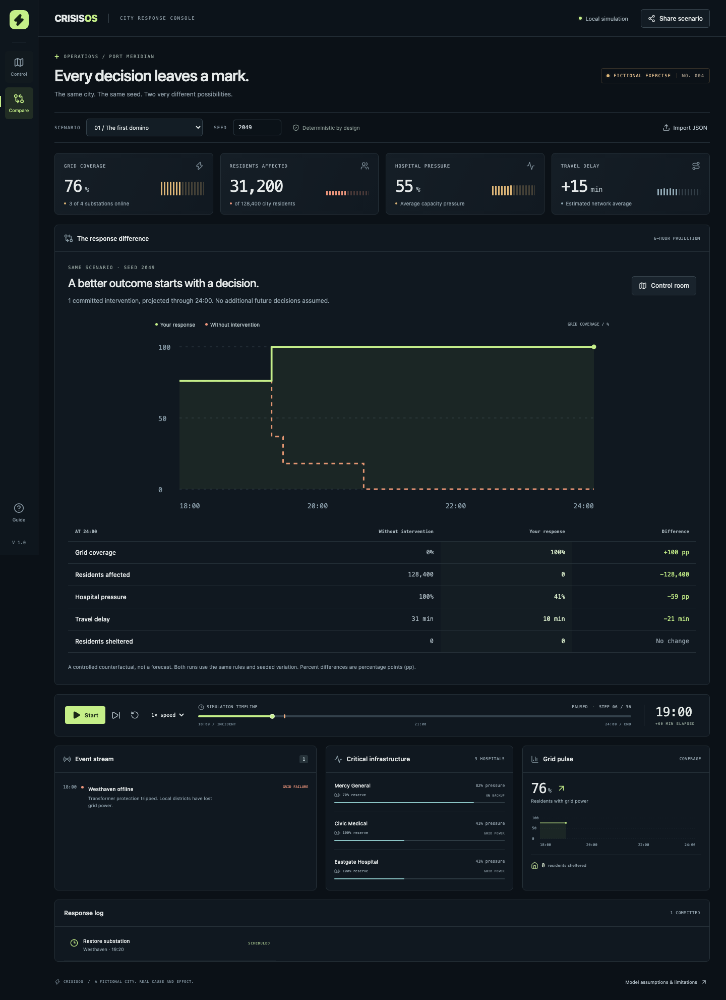
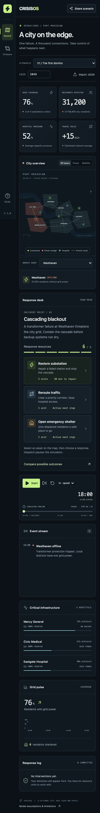

# CrisisOS

**A fictional city. A cascading blackout. Every decision changes what happens next.**

CrisisOS puts you at the response desk of Port Meridian, a city of 128,400 residents. A substation fails. Neighboring stations take the load, intersections become congested, and hospitals switch to finite battery reserves. Spend six response units to contain the cascade—or let it unfold, rewind, and study the difference.

Built with **React, TypeScript, and Vite**. The simulation, SVG city, charts, and replay run entirely in your browser. No backend, accounts, API keys, external map tiles, fonts, or paid services.

> This is an educational systems exercise using fictional data and deliberately simplified rules. It does not predict real emergencies and must not be used for operational decisions.



## Run locally

Use Node.js **22.13+ (22.x), 24.x, or 26+** (Node 22 LTS is used in CI) and npm.

```sh
git clone https://github.com/AyushPatra45/CrisisOS.git
cd CrisisOS
npm ci
npm run dev
```

Open the local URL printed by Vite, normally `http://127.0.0.1:5173`. The initial scenario is paused so you can inspect the city before the first step. To work from an existing workspace, run the npm commands there instead of cloning.

```sh
npm run build       # Type-check and build dist/
npm run preview     # Serve the production build locally
```

All application assets are bundled locally. Once the page is loaded, the simulation needs no network connection. An initial page load still requires a static server; this is not an installable/offline-cached PWA.

## Take the controls

1. Start with **The first domino**, seed **2049**. Westhaven is offline and 31,200 residents have lost grid power.
2. Select a substation, neighborhood, road, or hospital on the map to inspect its status. On small screens, the asset picker below the map provides a larger selection control.
3. Dispatch a response from the **Response desk**. You select a target and see its cost and effective time before committing.
4. Use **Next step** to advance ten simulated minutes, or **Start** for automatic playback.
5. Open **Compare** to see the six-hour outcome of your plan against an otherwise identical run with no interventions.

| Control         | Behavior                                                                                                          |
| --------------- | ----------------------------------------------------------------------------------------------------------------- |
| Start / Pause   | Play or pause the simulation; 1× advances one step every 1.5 seconds.                                             |
| Next step       | Pause and advance exactly ten simulated minutes.                                                                  |
| Speed           | 1×, 2×, or 4× playback; never changes simulated results.                                                          |
| Timeline        | Seek to any of 37 snapshots, from 18:00 through 24:00. Seeking pauses playback. Arrow keys also move the slider.  |
| Replay          | At the end, replay the same response plan from the start.                                                         |
| Reset           | Return to 18:00, clear interventions, and replenish resources. Keep the selected preset and seed.                 |
| Scenario / seed | Load a different exercise. Committing a new seed by Enter or leaving the field clears the timeline and responses. |
| Map layers      | Show all assets, emphasize power, or emphasize mobility.                                                          |
| Compare         | Project both runs to midnight using only already committed decisions.                                             |
| Share scenario  | Copy a reproducible URL or export a JSON file.                                                                    |
| Import JSON     | Validate and load a saved exercise; invalid files leave the current plan intact.                                  |
| Guide           | Read assumptions, controls, and model limitations in the app.                                                     |

A response is scheduled relative to the selected step. While replaying **before your latest decision**, new responses are disabled: advance to that decision or reset to create a different plan. This keeps imported and replayed plans chronological. There is no automatic persistence; export or copy a share link before closing the page.

### Three interventions

| Response               | Cost    | Activation                            | Effect                                                                                                                                         |
| ---------------------- | ------- | ------------------------------------- | ---------------------------------------------------------------------------------------------------------------------------------------------- |
| Restore substation     | 2 units | Two steps / 20 minutes after dispatch | Reconnect its districts, recharge local hospital batteries, and permanently reinforce the repaired station against cascades for this exercise. |
| Reroute traffic        | 1 unit  | Next step / 10 minutes                | Reduce one road’s congestion by 45 points, with a floor of zero. Lower congestion also reduces pressure at hospitals connected to that road.   |
| Open emergency shelter | 1 unit  | Next step / 10 minutes                | Shelter up to 750 local displaced residents per step, growing to 3,000. Reduce the local hospital’s unmet demand.                              |

You have **six nonrenewable resource units**. A given asset can receive each response type only once. Healthy substations cannot be repaired. Repairs that would finish after midnight cannot be dispatched. Opening a shelter in a powered district reserves capacity for a possible later outage; occupancy is zero until there are displaced residents.

### Three preset scenarios

| Scenario            | Initial outage       | Demand multiplier | Trip threshold | Battery drain / step | Base congestion |
| ------------------- | -------------------- | ----------------- | -------------- | -------------------- | --------------- |
| The first domino    | Westhaven            | 1.0               | 42             | 5                    | 20              |
| Heat under pressure | Civic Grid           | 1.6               | 38             | 8                    | 30              |
| A city divided      | Westhaven + Eastgate | 1.2               | 46             | 6                    | 35              |

The map contains four substations, six districts, seven road links, and three hospitals. Each preset uses the same city topology with distinct failure, demand, reserve, and traffic conditions.

## See the response difference



Comparison evaluates both runs through **24:00**, regardless of the current replay position. Both share the same preset and seed. Your run includes the committed plan; the baseline includes no interventions. The chart shows grid coverage, and the table compares affected residents, hospital pressure, delay, and shelter occupancy. Percentage differences are **percentage points**, not relative percentage changes. With no responses, the two runs are identical.

## Sharing and sample files

A simple link selects a preset and seed:

```text
https://your-host/CrisisOS/?scenario=blackout&seed=2049
```

The Share dialog also encodes the response plan in a `plan` URL parameter. The link is self-contained, not uploaded anywhere. It is **not encrypted**; the data is fictional. The recipient begins at 18:00 and can replay all saved decisions. Speed, current cursor, and selected map asset are presentation state and are not shared.

Importable examples are in [`public/scenarios/`](public/scenarios/):

- `blackout.json`, `heatwave.json`, and `double-fault.json`: untouched presets.
- `coordinated-response.json`: traffic and shelter responses at 18:10, followed by Westhaven restoration at 19:20.

```json
{
  "version": 1,
  "scenario": "blackout",
  "seed": 2049,
  "actions": [{ "id": "repair-west", "kind": "restore", "target": "west", "tick": 1 }]
}
```

An action’s `tick` is its scheduled next step: reroutes and shelters activate at that tick; restoration completes at `tick + 1`. The example is dispatched at 18:00 and completes at 18:20. Actions must be chronological, legal for the state immediately before their scheduled tick, uniquely identified, and within budget. Files reference an installed preset; they do not inject arbitrary executable rules or custom topology.

## Model and assumptions

The engine is a pure function: `simulate(scenario, seed, actions, until?) → Snapshot[]`. It uses no wall clock, `Math.random`, network, or React state. A stable integer hash of `(seed, step, asset ID)` produces independent variation for each asset, so intervention order does not consume or shift a shared random sequence. Snapshots are copied and remain independent.

At every ten-minute step:

1. **Repairs** due this step complete first.
2. **Grid stress** updates synchronously from the station state after repairs and before new trips. Each offline neighbor adds `demand × (4 + 2 × seededNoise)` stress. With no offline neighbors, stress falls by 6. Stress is clamped to 0–100. A station trips at the scenario threshold. New failures affect neighboring stress on the next step, not midway through the current loop. Repaired stations remain reinforced.
3. **Districts** inherit their supplying station’s power status. An unpowered district has `round(population × min(0.24, 0.06 + tick × 0.008))` displaced residents. This simplified displacement rate uses global elapsed exercise time, including for later outages. A powered district has zero displacement. Shelter occupancy is the minimum of displacement, elapsed shelter capacity (750 per step), and 3,000; there is no resident transfer between districts.
4. **Road congestion** is `round(clamp(base + 26 × unpoweredEndpoints + 8 × seededNoise − rerouteRelief, 0, 100))`. Reroute relief is 45. The displayed average delay is `round(meanCongestion × 0.4)` minutes.
5. **Hospital reserves** start at 100 and drain by the scenario rate each unpowered step after step zero. They recharge by 12 per powered step, capped at 100. A hospital has electrical power if its district is connected or its battery remains above zero. Capacity pressure is `round(clamp(30 + 0.45 × meanAdjacentRoadCongestion + localUnshelteredResidents / 180 + outagePenalty + depletedBatteryPenalty, 0, 100))`. The penalties are 13 during a district outage and 20 at zero reserve.
6. **Metrics and events** are recorded. Grid coverage is the population-weighted percentage with power, not the percentage of working stations. Hospital pressure is the unweighted mean across three hospitals. Reserve warnings appear on crossing 25%, and hospital strain events on crossing 85% pressure.

All numeric parameters are designed to expose understandable feedback and intervention effects. They have not been calibrated against a real city. In particular, rerouting always helps its selected link without adding congestion elsewhere, repairs have fixed durations, station reinforcement is permanent, shelter capacity is local, and battery recharge is simplified. There is no electrical power-flow calculation, route assignment, weather forecast, individual agent movement, mortality estimate, or emergency-service dispatch optimization.

## Architecture

```text
src/
  App.tsx                   Control room, playback, dialogs, comparison and charts
  CityMap.tsx               Interactive SVG districts, roads, stations and hospitals
  styles.css                Responsive theme and reduced-motion support
  simulation/
    types.ts                Scenario, action, snapshot and event contracts
    city.ts                 Fictional topology and population
    scenarios.ts            Typed preset registry
    engine.ts               Pure deterministic step engine and intervention rules
    events.ts               Typed event labels and severity registry
    sharing.ts              Strict file/URL validation and serialization
    *.test.ts               Rules, determinism, bounds and import tests
tests/
  journey.spec.ts            Main journey, replay, import, budget and accessibility
  screenshots.spec.ts       Responsive layout and reproducible README images
public/scenarios/           Importable sample response plans
.github/workflows/          Quality checks and opt-in GitHub Pages deployment
```

The UI stores only the selected scenario, seed, decisions, replay cursor, and display preferences. `useMemo` derives the response and baseline histories. A timer moves the cursor; it never updates simulated entities directly. SVG and native DOM controls keep the app lightweight and inspectable. System fonts and bundled Lucide icons avoid runtime third-party requests.

## Tests and checks

```sh
npm ci
npx playwright install chromium
npm run lint
npm run format:check
npm test
npm run build
npm run test:e2e
```

On Linux, use `npx playwright install --with-deps chromium` to install browser system dependencies. The E2E runner builds the app and starts the production preview on port **4175** automatically; stop unrelated servers on that port. The tests cover response effects, run/pause/speed controls, replay, comparison, shared URLs, exported-file import, malformed input, budget limits, keyboard map selection, dialogs, and viewport overflow from 320px through 1920px. Axe checks cover the control room, response dialog, comparison view, and mobile control room. Automated checks supplement manual browser inspection; they do not certify universal accessibility.

The screenshot tests regenerate the actual application captures used in this README under `docs/`. To update only screenshots:

```sh
npx playwright test tests/screenshots.spec.ts
```

`npm run format` formats the source and documentation. The lockfile is committed so `npm ci` reproduces dependencies. CI runs lint, formatting, unit tests, the production build, and Chromium E2E tests, retaining failure traces.

<details>
<summary>Mobile control room</summary>



</details>

## Contribute a scenario or event

See [`CONTRIBUTING.md`](CONTRIBUTING.md) for small, concrete extension recipes, the file contract, and the required checks. Adding a preset does not require modifying playback, sharing, or comparison: those read the central scenario registry.

## Deploy to GitHub Pages

The app is entirely static. `vite.config.ts` uses `base: './'`, so the generated assets work under `/CrisisOS/` as well as a custom domain. Sharing uses query parameters, so no SPA route fallback is necessary.

1. Push this repository to `AyushPatra45/CrisisOS` with its default branch named `main`.
2. In the GitHub repository, open **Settings → Pages → Build and deployment → Source** and choose **GitHub Actions**.
3. Open **Actions → Deploy to GitHub Pages → Run workflow**, select `main`, and run it.
4. The workflow runs the quality checks, uploads `dist/`, and deploys it. Open the URL reported by the `deploy` job (normally `https://ayushpatra45.github.io/CrisisOS/`).

Deployment is deliberately **manual** through `workflow_dispatch`; ordinary pushes only run quality checks. To deploy automatically after every main-branch push, add a `push: { branches: [main] }` trigger to `deploy.yml`. Repository Pages permissions and any environment approval rules still apply. The included files prepare deployment; creating this project locally does not itself publish the repository or enable Pages.

To publish from a fresh local repository, set the remote if it is not already configured, then push your committed branch:

```sh
git remote add origin https://github.com/AyushPatra45/CrisisOS.git
git push -u origin main
```

If `origin` already exists, inspect it with `git remote -v` instead of adding it again. Never force-push over existing remote history; integrate any existing commits first. Any static host can also serve the contents of `dist/`.

## License

[MIT](LICENSE). Fictional city geometry and sample scenarios are included under the same license. Lucide icons retain their upstream ISC license in the installed package.
